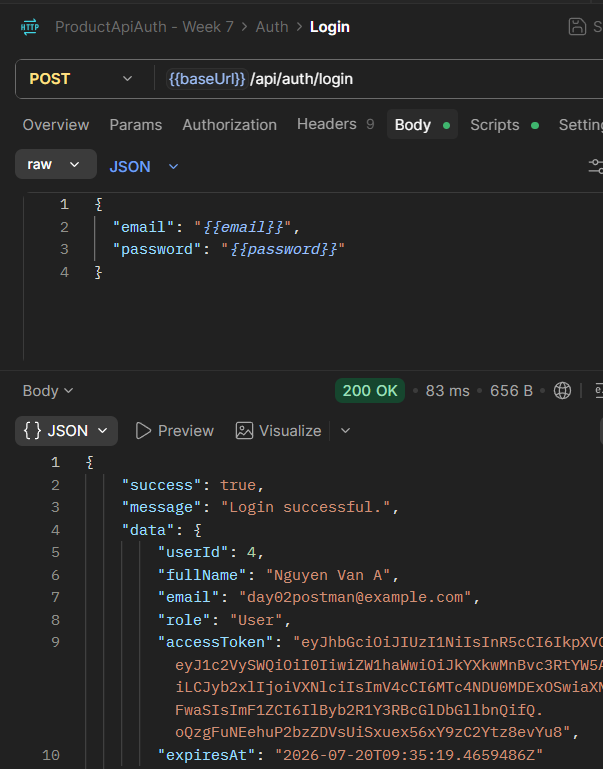
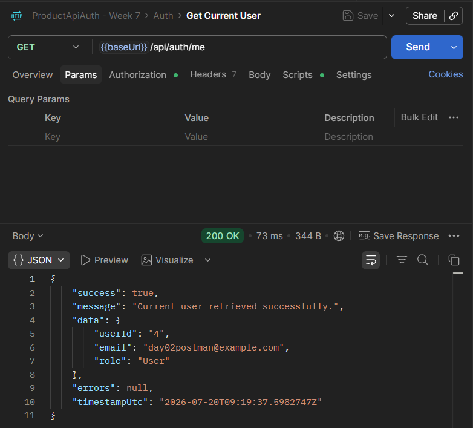
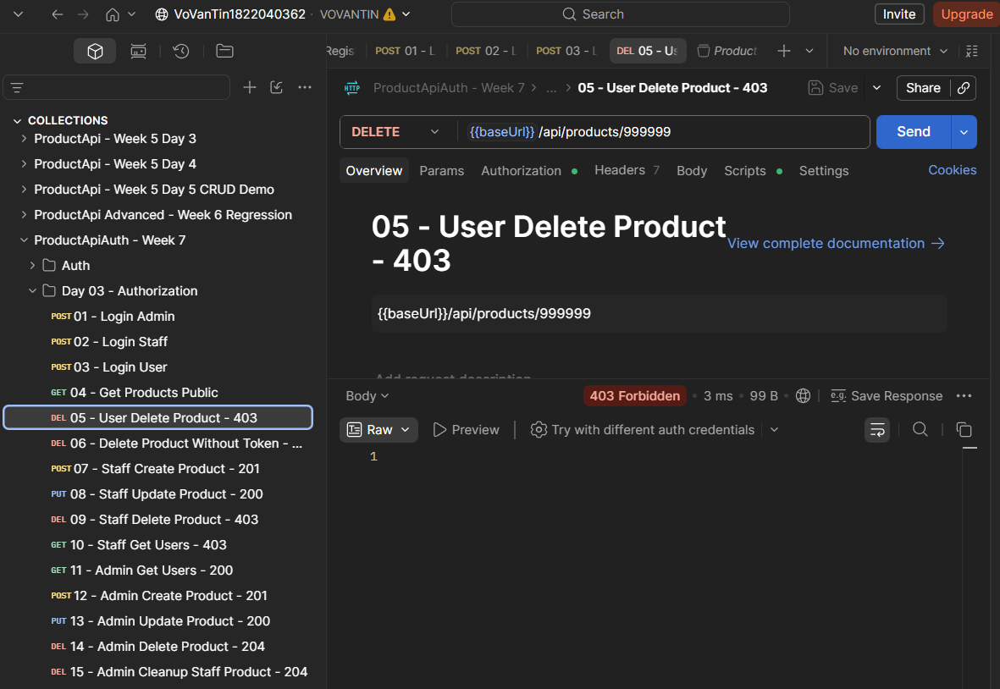
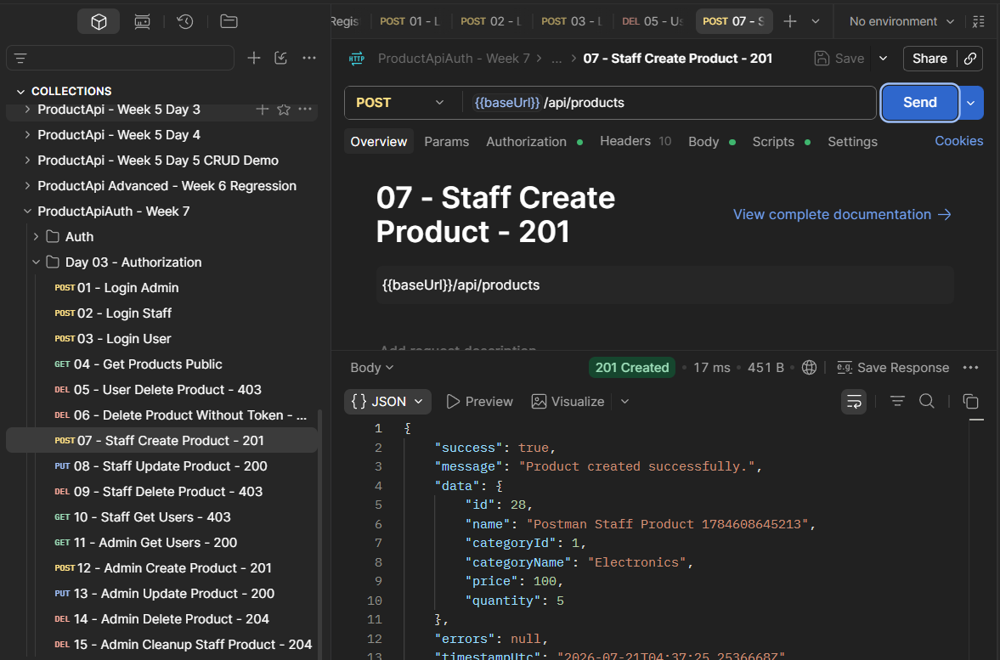
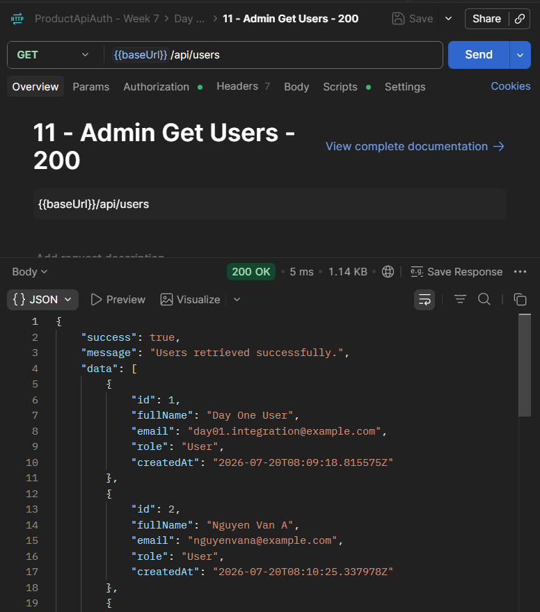

# ProductApiAuth

Product API xây dựng bằng ASP.NET Core 8, Entity Framework Core và PostgreSQL. Repo này dùng để làm phần Authentication và phân quyền của tuần 7.

## Day 01 - User và đăng ký tài khoản

- User entity gồm `Id`, `FullName`, `Email`, `PasswordHash`, `Role`, `CreatedAt`.
- Role nền tảng: `Admin`, `Staff`, `User`.
- Email không phân biệt hoa thường và có unique index trong PostgreSQL.
- `RegisterDto`, `LoginDto`, `AuthResponseDto`.
- Hash và verify password bằng `PasswordHasher<User>`.
- API `POST /api/auth/register`.
- Chặn email trùng với status `409 Conflict`.
- Validate password từ 6 đến 100 ký tự với status `400 Bad Request`.
- Response đăng ký không trả password hoặc password hash.

## Day 02 - Đăng nhập và JWT

- API `POST /api/auth/login` kiểm tra email và password đã hash.
- Login thành công trả access token và thời điểm token hết hạn.
- JWT có các claims `userId`, `email`, `role`.
- Token được kiểm tra issuer, audience, chữ ký và thời hạn.
- Swagger có nút Authorize để nhập Bearer token.
- API `GET /api/auth/me` đọc thông tin user từ token và yêu cầu đăng nhập.
- Email không tồn tại hoặc password sai đều trả `401 Unauthorized` với cùng một thông báo.

## Day 03 - Phân quyền theo role

- GET Product vẫn public, không cần đăng nhập.
- Admin và Staff được tạo, cập nhật Product.
- Chỉ Admin được xóa Product và xem danh sách User.
- Danh sách User không trả `PasswordHash`.
- User đã đăng nhập nhưng không đủ quyền nhận `403 Forbidden`.

## Day 04 - Refresh token và logout

- Login trả cả access token và refresh token.
- Refresh token gốc chỉ trả về client; database lưu bản băm SHA-256.
- API `POST /api/auth/refresh` cấp cặp token mới khi refresh token còn hiệu lực.
- Mỗi lần refresh thành công, token cũ bị thu hồi và không thể dùng lại.
- API `POST /api/auth/logout` thu hồi refresh token của phiên hiện tại.
- Token không tồn tại, hết hạn hoặc đã bị thu hồi đều nhận `401 Unauthorized`.

## Công nghệ

- .NET 8
- ASP.NET Core Web API
- Entity Framework Core 8
- PostgreSQL
- Swagger / OpenAPI
- JWT Bearer Authentication

## Cấu hình database

Connection string không để trong source. Project đọc cấu hình từ .NET User Secrets với key:

```text
ConnectionStrings:DefaultConnection
```

Thiết lập trên máy local:

```cmd
dotnet user-secrets set "ConnectionStrings:DefaultConnection" "Host=localhost;Port=5432;Database=ProductApiDb;Username=postgres;Password=YOUR_PASSWORD" --project src/ProductApi/ProductApi.csproj
```

## Cấu hình JWT

JWT cũng được đọc từ .NET User Secrets. Có thể dùng các giá trị local sau và tự thay secret bằng chuỗi ngẫu nhiên dài ít nhất 32 ký tự:

```cmd
dotnet user-secrets set "Jwt:Issuer" "ProductApi" --project src/ProductApi/ProductApi.csproj
dotnet user-secrets set "Jwt:Audience" "ProductApiClient" --project src/ProductApi/ProductApi.csproj
dotnet user-secrets set "Jwt:AccessTokenMinutes" "15" --project src/ProductApi/ProductApi.csproj
dotnet user-secrets set "Jwt:RefreshTokenDays" "7" --project src/ProductApi/ProductApi.csproj
dotnet user-secrets set "Jwt:Secret" "YOUR_RANDOM_SECRET_AT_LEAST_32_CHARACTERS" --project src/ProductApi/ProductApi.csproj
```

## Khởi tạo database

```cmd
dotnet ef database update --project src/ProductApi/ProductApi.csproj --startup-project src/ProductApi/ProductApi.csproj
```

Migration Day 01 tạo bảng `Users` với unique index trên email. Migration Day 04 tạo bảng `RefreshTokens`, liên kết token với User và đặt unique index trên `TokenHash`.

## Chạy API

```cmd
dotnet run --project src/ProductApi/ProductApi.csproj
```

Sau khi chạy, mở Swagger theo địa chỉ hiện trong terminal. Ví dụ:

```text
http://localhost:5291/swagger
```

## Đăng ký tài khoản

Endpoint:

```http
POST /api/auth/register
Content-Type: application/json
```

Request hợp lệ:

```json
{
  "fullName": "Nguyen Van A",
  "email": "nguyenvana@example.com",
  "password": "Secret123!"
}
```

Nếu thành công API trả `201 Created`, role mặc định là `User`.

Một số trường hợp lỗi:

- Email đã tồn tại: `409 Conflict`.
- Password ngắn hơn 6 ký tự: `400 Bad Request`.
- Email sai định dạng hoặc thiếu trường bắt buộc: `400 Bad Request`.

## Đăng nhập

Endpoint:

```http
POST /api/auth/login
Content-Type: application/json
```

Request:

```json
{
  "email": "nguyenvana@example.com",
  "password": "Secret123!"
}
```

Login thành công trả `200 OK` cùng access token, refresh token và thời hạn của từng token. Lấy giá trị `data.accessToken`, bấm **Authorize** trong Swagger rồi dán token vào ô xác thực. Swagger sẽ tự gửi header Bearer cho các request tiếp theo.

Sau khi authorize, gọi:

```http
GET /api/auth/me
```

Endpoint này trả `userId`, `email`, `role` từ token. Nếu không có token, token không hợp lệ hoặc đã hết hạn thì API trả `401 Unauthorized`.

## Làm mới phiên đăng nhập

Khi access token hết hạn, gửi refresh token nhận được lúc login đến:

```http
POST /api/auth/refresh
Content-Type: application/json
```

```json
{
  "refreshToken": "REFRESH_TOKEN"
}
```

Nếu token hợp lệ, API trả access token và refresh token mới. Refresh token vừa gửi sẽ bị thu hồi ngay; dùng lại token cũ sẽ nhận `401 Unauthorized`. Cách này gọi là token rotation, giúp giảm rủi ro nếu một refresh token cũ bị lộ.

## Logout

```http
POST /api/auth/logout
Content-Type: application/json
```

```json
{
  "refreshToken": "REFRESH_TOKEN"
}
```

Logout thành công trả `200 OK` và đánh dấu token đã bị thu hồi. Sau đó token này không thể dùng để refresh nữa. Endpoint logout không yêu cầu access token vì refresh token trong body đã xác định phiên cần kết thúc.

## Bảng phân quyền

| API | Public | User | Staff | Admin |
| --- | :---: | :---: | :---: | :---: |
| `GET /api/products` | Có | Có | Có | Có |
| `GET /api/products/{id}` | Có | Có | Có | Có |
| `POST /api/products` | Không | Không | Có | Có |
| `PUT /api/products/{id}` | Không | Không | Có | Có |
| `DELETE /api/products/{id}` | Không | Không | Không | Có |
| `GET /api/users` | Không | Không | Không | Có |

- `401 Unauthorized`: request chưa gửi token hoặc token không hợp lệ, hết hạn.
- `403 Forbidden`: token hợp lệ nhưng role của tài khoản không có quyền dùng API đó.

## Test bằng Postman

Import file `postman/ProductApiAuth.postman_collection.json` vào Postman. Collection có sẵn flow đăng ký, đăng nhập và kiểm tra quyền của Admin, Staff, User.

Flow Day 02:

1. `Register` để tạo tài khoản test.
2. `Login` để nhận JWT. Script của request sẽ tự lưu `data.accessToken` vào biến `accessToken`.
3. `Get Current User` để gọi `/api/auth/me` bằng token vừa lưu.

Login trả JWT:



Token được dùng lại để đọc thông tin user:



Flow Day 03 đăng nhập ba role, tự lưu token rồi kiểm tra từng quyền. Chạy toàn bộ collection bằng Newman đã hoàn thành 15 request và 19 assertion, không có lỗi.

Flow Day 04 nằm trong folder `Day 04 - Refresh Token`:

1. Login và lưu access token, refresh token.
2. Refresh token và kiểm tra token mới khác token cũ.
3. Dùng lại token cũ, kết quả phải là `401`.
4. Logout bằng token mới.
5. Dùng token vừa logout để refresh, kết quả phải là `401`.

Folder Day 04 đã chạy bằng Newman với 5 request và 12 assertion, không có lỗi.

User gọi DELETE Product nhận `403 Forbidden`:



Staff tạo Product thành công với `201 Created`:



Admin xem danh sách User thành công và response không có `PasswordHash`:



## Kết quả kiểm tra

- Đăng ký hợp lệ trả `201`.
- Email trùng, kể cả khác chữ hoa/thường, trả `409`.
- Password 5 ký tự trả `400`.
- Trong database chỉ lưu `PasswordHash`, không lưu mật khẩu gốc.
- Login đúng trả `200`, access token và expiration.
- Login sai password hoặc email không tồn tại trả `401`.
- `/api/auth/me` trả đúng `userId`, `email`, `role` khi token hợp lệ.
- `/api/auth/me` không có token hoặc dùng token sai trả `401`.
- JWT có đúng issuer, audience, expiration và các claims đã cấu hình.
- Swagger hiển thị Bearer scheme và hai endpoint login/me.
- Postman tự lưu access token sau khi login và dùng lại cho `/api/auth/me`.
- GET Product không cần token vẫn truy cập được.
- Staff tạo và cập nhật Product thành công; xóa Product và xem danh sách User nhận `403`.
- User thường xóa Product nhận `403`.
- Request không có token gọi API cần đăng nhập nhận `401`.
- Admin tạo, cập nhật, xóa Product và xem danh sách User thành công.
- Response của `GET /api/users` không trả `PasswordHash`.
- Newman chạy đủ 15 request, 19 assertion của Day 03 và không có lỗi.
- Login trả refresh token có thời hạn 7 ngày theo cấu hình local.
- Refresh hợp lệ trả cặp token mới và thu hồi token cũ.
- Refresh token không tồn tại, hết hạn hoặc đã bị thu hồi đều trả `401`.
- Logout thành công trả `200`; refresh lại bằng token vừa logout trả `401`.
- Newman chạy flow Day 04 với 5 request, 12 assertion và không có lỗi.

## Lưu ý

- Không commit connection string, password database, token hoặc JWT secret.
- API response không trả `PasswordHash`.
- Email được chuyển về chữ thường trước khi lưu.
- Email trùng được kiểm tra ở service và unique constraint của database.
- Access token có thời hạn mặc định 15 phút, refresh token mặc định 7 ngày.
- Database chỉ lưu hash của refresh token, không lưu token gốc.
- Token rotation và logout chỉ vô hiệu hóa refresh token; access token đã cấp vẫn dùng được đến khi tự hết hạn.
- Trong môi trường thật nên truyền token qua HTTPS và giữ refresh token ở nơi lưu trữ an toàn phía client.
